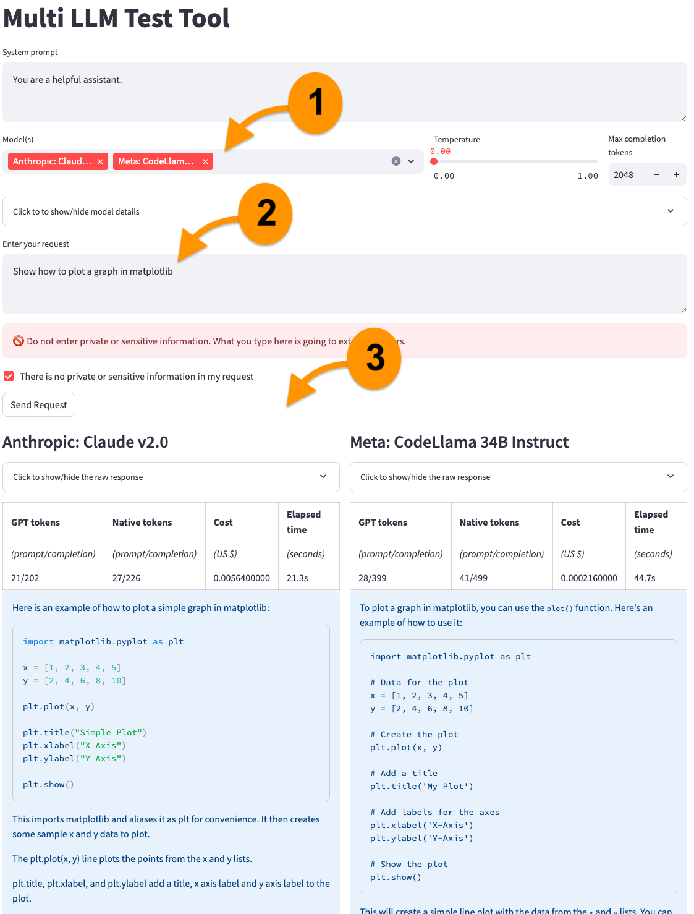

# Comparing large language models

This project allows us to test prompts against multiple large language models and compare the results.

1. Select models to compare.
1. Enter a question or prompt.
1. Compare the results.

<!-- markdownlint-disable MD033 -->


It uses [OpenRouter](https://openrouter.ai/) to connect to [different models](https://openrouter.ai/docs#models). Some models are free, others aren't. If you decide to use paid models, OpenRouter has a credit limit to avoid surprise bills.

**WARNING**: Do not use this project for private and confidential information. OpenRouter connects to different providers. I cannot vouch for OpenRouter's and providers' privacy policies. Assume that what you send to OpenRouter is public and act accordingly.

## Quick get-started guide

First, [prepare the environment](#preparing-the-environment), if you haven't done so yet.

Run the following commands to activate the environment and start the application in a browser.

```bash
source venv/bin/activate
streamlit run app.py
```

Open the URL shown in the terminal in a browser.

## Running as a container

1. Build the container: `docker build --progress=plain -t llm-comparison .`
2. Start the container: `docker compose up -d`
3. Open a browser window to <http://machine_address:8501> (if running locally: <http://localhost:8501>)
4. Stop the container when done: `docker compose down`

## Preparing the environment

This is a one-time step. If you have already done this, just activate the virtual environment with `source venv/bin/activate`.

There are two steps to prepare the environment.

1. [Python environment](#python-environment)
1. [OpenRouter API key](#openrouter-api-key)

### Python environment

Run the following commands to create a virtual environment and install the required packages.

```bash
python3 -m venv venv
source venv/bin/activate
pip install --upgrade pip
pip install -r requirements.txt
```

### OpenRouter API key

The code uses [OpenRouter](https://openrouter.ai/) to access multiple models. See [here](https://openrouter.ai/docs#models) for a list of supported models.

If you already have an OpenRouter account, create an API key [here](https://openrouter.ai/keys). If you don't have an account, create one [here](https://openrouter.ai/), then create the API key. Optionally, add credits if you plan to use paid models.

Once you have the API key, create a `.env` file in the project root directory with the following content.

```bash
OPENROUTER_API_KEY=<your key>
```

It is safe to add the key here. It will never be committed to the repository.
